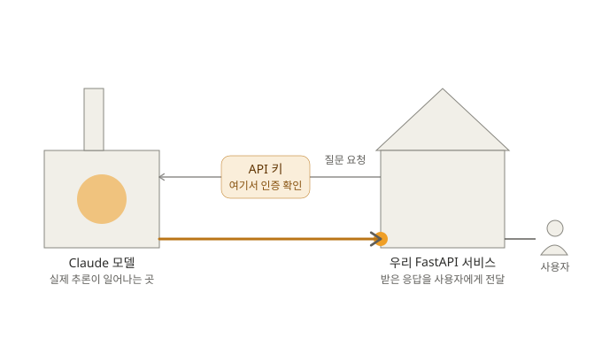

# API 키로 외부 LLM(Claude)을 가져와 내 서비스에서 작동시키는 과정

이 문서는 `mini_project`가 **Claude API 키 하나로 외부 LLM의 기능을 우리 FastAPI 서비스 안에서 작동시키는 전체 메커니즘**을 정리한 것입니다.

## 한눈에 보는 다이어그램



전력망에 빗댄 그림입니다.

- **발전소(Claude 모델)** — 실제 "지능"은 여기서만 만들어집니다. 우리 서버 안에는 지능이 없습니다.
- **질문 요청(가는 선)** — 우리가 보내는 건 `{"messages": [...], "model": "..."}` 같은 작은 JSON 하나뿐입니다.
- **API 키 게이트** — 요청이 발전소에 도착하기 **직전**에 위치합니다. 여기서 인증이 확인되어야만 발전소가 추론을 시작합니다.
- **응답 토큰 스트림(굵은 선)** — 게이트를 통과한 뒤에는 별도 검사 없이 곧장 흘러 들어옵니다.
- **우리 집(FastAPI 서비스)** — 발전소가 아니라 배전(캐싱·로깅·전달)만 담당합니다.

## API 키는 "보낼 때" 사용되지 "받을 때" 사용되지 않는다

- **우리 쪽(클라이언트)**: 요청을 만드는 순간 키를 헤더에 붙여서 내보냅니다. "받을 때 쓰는" 동작은 없습니다.
- **서버(Anthropic) 쪽**: 요청을 받자마자 — 응답을 생성하기도 전에 — 키부터 검사합니다. 틀리면 그 자리에서 거절합니다.

## 실제 코드 매핑

| 그림 요소 | 실제 코드 |
|---|---|
| 질문 요청 조립 | [`app/services/chat_service.py`](../mini_project/app/services/chat_service.py) `_build_messages()` |
| 요청 전송 | [`app/services/chat_service.py`](../mini_project/app/services/chat_service.py) `stream_chat_safe()` → [`app/clients/openai_client.py`](../mini_project/app/clients/openai_client.py) `stream_chat()` |
| API 키 게이트(키를 심어둠) | [`app/core/config.py`](../mini_project/app/core/config.py) `API_KEY` + [`app/clients/openai_client.py`](../mini_project/app/clients/openai_client.py) `get_client()` |
| 발전소 | Anthropic 서버 (저장소 코드 밖, `https://api.anthropic.com/v1/`) |
| 응답 토큰 스트림 | [`app/clients/openai_client.py`](../mini_project/app/clients/openai_client.py) `stream_chat()`의 `async for chunk in stream` 루프 |
| 우리 집 배전(캐싱/로깅) | [`app/services/chat_service.py`](../mini_project/app/services/chat_service.py) `stream_chat_safe()`의 `cache.set(...)` / `logger.info(...)` |
| 사용자에게 전달 | [`app/routers/chat.py`](../mini_project/app/routers/chat.py) `chat_stream()` (`StreamingResponse`) |

**키가 등장하는 코드는 딱 두 곳뿐입니다** (`config.py`의 `API_KEY`, `openai_client.py`의 `get_client()`). 둘 다 "요청을 만들기 전에 미리 심어두는" 역할이고, 그 이후 어떤 코드(`stream_chat`, `stream_chat_safe`, `chat_stream`)에도 키를 다시 검사하거나 사용하는 로직은 없습니다 — 검사는 전적으로 Anthropic 서버 몫입니다.

```python
# app/core/config.py — 키를 환경 변수에서 읽어둠
API_KEY = os.getenv("MLAPI_API_KEY")

# app/clients/openai_client.py — 클라이언트를 만들 때 키를 심어둠
def get_client() -> AsyncOpenAI:
    return AsyncOpenAI(api_key=API_KEY, base_url=BASE_URL)
```

이후 `_client.chat.completions.create(...)`를 호출할 때마다 OpenAI SDK가 자동으로 `Authorization: Bearer sk-ant-...` 헤더를 붙여 요청과 함께 내보냅니다.

## OpenAI 호환 계층이 실제로 하는 변환

우리 코드는 `openai` 파이썬 SDK를 그대로 쓰지만, `base_url`만 `https://api.anthropic.com/v1/`로 바꿔서 Claude를 호출합니다. Anthropic이 만든 **OpenAI 호환 엔드포인트**가 중간에서 두 포맷을 서로 번역해줍니다.

### 요청 포맷 차이

**우리가 실제로 보내는 것 (OpenAI 호환, `/v1/chat/completions`)**

```json
{
  "messages": [
    {"role": "system", "content": "..."},
    {"role": "user", "content": "안녕?"}
  ],
  "model": "claude-haiku-4-5-20251001",
  "stream": true,
  "temperature": 1.0
}
```

**Claude 네이티브 포맷이라면 (`/v1/messages`)**

```json
{
  "model": "claude-haiku-4-5-20251001",
  "system": "...",
  "messages": [
    {"role": "user", "content": "안녕?"}
  ],
  "max_tokens": 200,
  "temperature": 1.0,
  "stream": true
}
```

차이 두 가지: (1) `system`이 `messages` 배열 안에 있는지 최상위 필드로 분리돼 있는지, (2) 네이티브는 `max_tokens`가 필수인데 OpenAI 포맷 요청엔 없어도 호환 계층이 기본값을 채워 넣어준다는 점.

### 응답(스트리밍) 포맷 차이

**Claude 네이티브가 실제로 보내는 SSE 이벤트** — 여러 타입이 섞여 있습니다.

```
event: message_start
data: {"type":"message_start","message":{"id":"msg_...","usage":{"input_tokens":31,...}}}

event: content_block_start
data: {"type":"content_block_start","index":0,"content_block":{"type":"text","text":""}}

event: ping
data: {"type": "ping"}

event: content_block_delta
data: {"type":"content_block_delta","index":0,"delta":{"type":"text_delta","text":"안녕하세"}}
```

**OpenAI 호환 계층이 우리에게 실제로 보내는 것** — 전부 같은 타입 하나로 압축됩니다.

```json
{"id":"msg_...","object":"chat.completion.chunk","choices":[{"delta":{"content":"..."}}]}
```

호환 계층이 하는 일: `message_start`의 메타데이터를 첫 청크로, `content_block_delta.delta.text`를 `choices[0].delta.content`로 옮기고, `ping`(Anthropic 전용 keep-alive)은 그냥 버립니다. 응답의 `id`만은 변환하지 않고 Claude 네이티브 형식(`msg_...`)을 그대로 흘려보냅니다 — OpenAI라면 `chatcmpl-...` 형태여야 하는데, 이게 "실제로는 Claude가 응답하고 있다"는 가장 직접적인 증거입니다.

## 정리

`MLAPI_API_KEY` 한 줄을 `.env`에 넣은 순간, 우리 서비스가 스스로 똑똑해진 게 아니라 — Claude라는 발전소에 "요금 낼 준비가 된 집"으로 등록된 것뿐입니다. 우리 코드가 하는 일은 처음부터 끝까지 **잘 물어보고, 잘 전달하기**입니다.
